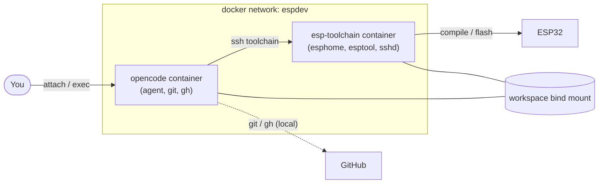

# ESPHome + opencode Dev Setup

A small, two-container development environment for ESPHome projects:

- **`opencode`** — the [opencode](https://opencode.ai) AI coding agent. Edits files,
  runs shell commands, and is the only place GitHub credentials exist.
- **`esp-toolchain`** — an Ubuntu container with **ESPHome** + **esptool** that
  actually compiles and flashes firmware, reached over SSH.
- Both containers share `./workspace`, so they always see the same files.

> **`BoilerController` is just an example.** It is a specific ESP32-C3 project used
> in the docs to make things concrete. Point the setup at any ESPHome project placed
> under `workspace/`.

Full documentation lives in the **[wiki](https://github.com/fotovlieger/ESPHOME_OpenCode/wiki)**
(sources in [`wiki/`](wiki/)).

## How it works



A shell wrapper (`opencode/toolchain`) routes every command: `git`/`gh` run locally
in the agent container, everything else is forwarded over SSH to the toolchain.
See [[Command Routing]].

## Prerequisites

Create these local files (all gitignored):

```bash
cd ESPHOME_OpenCode

# 1. SSH key pair (agent -> toolchain, and GitHub)
mkdir -p ssh && ssh-keygen -t ed25519 -N '' -f ssh/id_ed25519

# 2. Environment / token
cp .env.example .env && $EDITOR .env

# 3. Git identity
mkdir -p .gitconfig
cp gitconfig.example .gitconfig/.gitconfig && $EDITOR .gitconfig/.gitconfig
```

Docker + Docker Compose are required on the host.

## Quick start

```bash
docker compose up -d --build      # build and start both containers
docker attach opencode            # or: docker exec -it opencode bash
```

Then ask the agent to build or flash your ESPHome project.

## Layout

```
.
├── docker-compose.yml      # services, network, volumes
├── .env.example            # GITHUB_TOKEN + git identity (copy to .env)
├── gitconfig.example       # git credential helper (copy to .gitconfig/.gitconfig)
├── opencode/
│   ├── Dockerfile          # agent image
│   ├── ssh_config          # "Host toolchain" -> esp-toolchain
│   └── toolchain           # shell wrapper / command router
├── toolchain/
│   ├── Dockerfile          # Ubuntu + esphome venv
│   └── entrypoint.sh       # sshd, key install, USB serial node watcher
├── workspace/              # your ESPHome project(s) go here (not tracked)
└── wiki/                   # documentation (GitHub wiki sources)
```

## Security

No secrets are committed. `.env`, SSH private keys, `.gitconfig/.gitconfig`,
`secrets.yaml`, and build artifacts are gitignored. The toolchain container only
ever receives the agent's **public** key.
