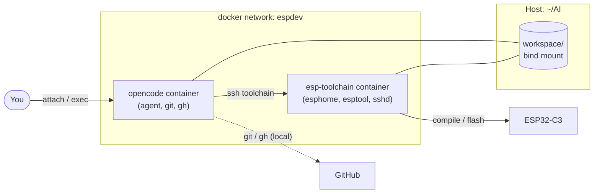

# ESPHome + opencode Development Setup

This wiki documents a containerised ESPHome development environment: one container
runs **opencode** (the AI coding agent), another runs the **ESP toolchain**
(ESPHome + esptool) that actually builds and flashes firmware.

The two containers share a single host directory, so the agent and the toolchain
always look at exactly the same files.

> [!NOTE]
> **`BoilerController` is just an example.** It is a specific ESP32-C3 ESPHome
> project used throughout this wiki to make the workflow concrete. The setup is
> generic — point it at any ESPHome project under `workspace/`.

---

## At a glance



- **opencode container** — the agent's brain. Edits files, runs shell commands,
  and is the only place GitHub credentials exist.
- **esp-toolchain container** — the muscle. Runs `esphome` / `esptool` builds and
  uploads. Reached over SSH.
- **`./workspace`** — bind-mounted at `/workspace` in **both** containers, so paths
  are identical on either side.

## Quick start

```bash
cd ~/AI
docker compose up -d --build          # build + start both containers
docker exec -it opencode bash         # get a shell in the agent container
# ...or attach to the running TUI:
docker attach opencode
```

Then, from inside opencode, just ask it to build or flash — it will route the
commands for you.

## Pages

| Page | What it covers |
|------|----------------|
| [[Architecture]] | Containers, network, data flow, why two containers |
| [[Containers]] | Dockerfiles, images, users, mounts, volumes |
| [[Command Routing]] | How the `toolchain` shell wrapper decides local vs remote |
| [[Workflow]] | Day-to-day: edit, build, flash, logs, git |
| [[USB Serial Passthrough]] | Exposing `ttyUSB*` / `ttyACM*` without mounting `/dev` |
| [[Persistence and Restart]] | What survives restarts and what does not |
| [[Troubleshooting]] | Common failures and fixes |

## Repository layout

```
~/AI/
├── docker-compose.yml          # both services, network, volumes
├── .env                        # GITHUB_TOKEN + git author (not committed)
├── .gitconfig/.gitconfig       # token-based git credential helper
├── ssh/                        # id_ed25519 (agent → toolchain, GitHub)
├── opencode/
│   ├── Dockerfile              # agent image
│   ├── ssh_config              # "Host toolchain" → esp-toolchain
│   └── toolchain               # shell wrapper (command router)
├── toolchain/
│   ├── Dockerfile              # Ubuntu + esphome venv
│   └── entrypoint.sh           # sshd, key install, serial node watcher
├── workspace/                  # bind-mounted into both containers
│   ├── opencode.json           # sets shell=/usr/local/bin/toolchain
│   └── BoilerController/       # the ESPHome project (its own git repo)
└── wiki/                       # this documentation
```

> [!NOTE]
> Secrets are never stored in the wiki. Values such as `GITHUB_TOKEN`,
> `secrets.yaml` (WiFi / OTA / MQTT) are referenced by name only.
